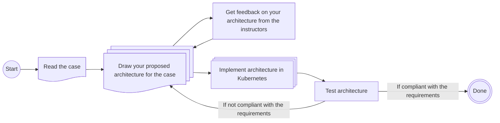

# Lecture 02 - HDFS and different file formats

This week's exercises will use the case-based structure described in the general overview from Lecture 01's exercise. To summarize the process:

- You will be presented with a case that needs solving.
- You must design the architecture you believe can solve this problem (use your preferred drawing tool, e.g., draw.io, Excalidraw, etc.).
    - Ideally, using the technologies covered in the course so far.
    - You will receive feedback on your proposed architecture from the instructors.
- Once the architecture has been drawn, try to assemble it using the selected technologies and blueprints.

The process can be visualized as follows:

## New Technologies

The new technologies introduced this week are: **HDFS, Avro and Parquet**

For some general quick start guidance on utilising the technologies, please view the archived exerises from [Lecture 02 E24](https://github.com/JakobHviidBDDST/BigDataCourseExercises/tree/main/archive/E24/02)

## Case Description

ReadBooks Inc. needs to store digital copies of all their books (+10M) containing the content of the books and appropriate metadata. They also want to enable analytics capabilities to present statistics of their inventories, such as word counts for specific book titles, overall word counts, etc.

### Solution Requirements

- The solution must store books with their names and entire contents in a proper file format.
- The solution must persist the data to a distributed filesystem.
- The solution should be able to store +10M books.
- The solution should have means to efficiently query word counts using various criteria.

### Demonstrate

- How to store book content and relevant metadata in distributed filesystem
- How to read and write data in the chosen format
- How to query data in the chosen format

### Remember to

- Identify bottlenecks.
- Pick appropriate data format.
- Consider how scalability will be handled.
- Address data flow.
- Address how processed results will be accessed/presented.
- Present arguments for:
    - The chosen file format.
    - The chosen architecture.
    - The chosen technologies.
