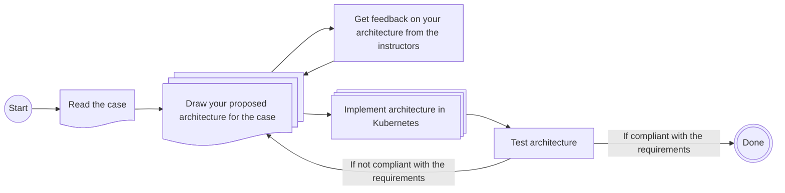

# Lecture 03 - Distributed Transport and Streaming

This week's exercises will use the case-based structure described in the general overview from Lecture 01's exercise. To summarize the process:

- You will be presented with a case that needs solving.
- You must design the architecture you believe can solve this problem (use your preferred drawing tool, e.g., draw.io, Excalidraw, etc.).
  - Ideally, using the technologies covered in the course so far.
  - You will receive feedback on your proposed architecture from the instructors.
- Once the architecture has been drawn, try to assemble it using the selected technologies and blueprints.

The process can be visualized as follows:

## New Technologies

The new technologies introduced this week are: **Kafka, Kafka Connect, KSQLDB, Flume, and Sqoop**.

For some general quick start guidance on utilising the technologies, please view the archived exerises from [Lecture 03 E24](https://github.com/JakobHviidBDDST/BigDataCourseExercises/tree/main/archive/E24/03).

## Case Description

PowerGrid Analytics LLC monitors a electric power grid, where they measure the wattage use, they get their data from multiple data sources with variable sample rates, where each data source has a unique ID. They need to capture and store this data in real time.

However, they already have large amounts of telemetry on the grid stored in a SQL based database, that needs to be integrated into a new system with the continuous streams of data.

There are also rumors that some old employees of theirs have mountains of unorganized data stored outside of their databses, that they say is essential to the running of the grid...👷🏽‍♂️

### Solution Requirements

- The solution must ingest large amounts data from multiple data sources in real time.
- The solution should be able to ingest structured database information.
- The solution should be able to ingest unstructured data.
- Streams should be routed and processed by sensor ID.
- The solution must persist the data to a distributed filesystem.

### Demonstrate

- How to do live ingestion data from multiple sources.
- How to ingest structured data from a database.
- How to move data from a stream processing platform to long term distributed storage.
- How to process and route streaming data in real-time.

### Remember to

- Identify bottlenecks.
- Pick appropriate ingestion technologies.
- Consider how scalability will be handled.
- Address data flow.
- Present arguments for:
  - The chosen streaming architecture format.
  - The chosen integration tools.
  - The chosen technologies.
