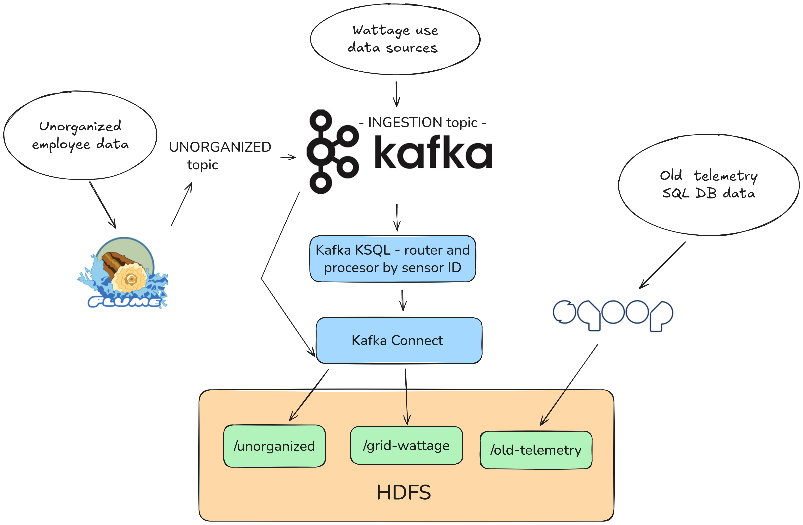

# Lecture 03 - Distributed Transport and Streaming (solution)

## Case Description

PowerGrid Analytics LLC monitors an electric power grid, where they measure the wattage used. They obtain their data from multiple sources with different sample rates, each identified by a unique ID. They need to collect and store this data immediately.

However, they already have large amounts of telemetry on the grid stored in a SQL-based database that needs to be integrated into a new system with continuous data streams.

There are also rumors that some former employees have mountains of unorganized data stored outside their databases, which they claim is essential to the operation of the grid...👷🏽‍♂️


### Solution Requirements

- The solution must ingest large amounts of data from multiple sources in real time.
- The solution should be capable of ingesting structured database information. 
- The solution should be capable of processing unstructured data. 
- Streams should be routed and processed by sensor ID.
- The solution must persist the data to a distributed filesystem.

### Demonstrate

- How to do live ingestion of data from multiple sources.
- How to ingest structured data from a database.
- How to transfer data from a stream processing platform to long-term distributed storage.
- How to process and route streaming data in real-time.

### Remember to

- Identify bottlenecks.
- Pick appropriate ingestion technologies.
- Consider how scalability will be handled.
- Address data flow.
- Present arguments for:
  - The chosen streaming architecture format.
  - The chosen integration tools.
  - The chosen technologies.

# Solution Proposal

## Architecture




## Deployment of technologies

### Deploy and set up HDFS

Read the instructions in the [HDFS service README](../../../services/hdfs/README.md) and deploy the HDFS cluster using the provided Kubernetes manifests.

```zsh
kubectl apply -f ../../../services/hdfs/configmap.yaml
kubectl apply -f ../../../services/hdfs/namenode.yaml
kubectl apply -f ../../../services/hdfs/datanodes.yaml
```

*Verify*

```zsh
kubectl port-forward svc/namenode 9870
```

```zsh
curl -s -XGET "http://localhost:9870/webhdfs/v1/?op=LISTSTATUS"
```

Deploy the client pod to interact with HDFS. I will use the provided [interactive.yaml](../../../services/interactive/interactive.yaml) manifest in the `services/interactive` folder.

```zsh
kubectl apply -f ../../../services/interactive/interactive.yaml
```

*Verify*

Attach to the pod using VS Code ([README.md](../../../services/interactive/README.md#attach-visual-studio-code-to-a-running-container)) or `kubectl exec -it pod/interactive-*-* -- /bin/bash`

```zsh
curl -s -XGET "http://namenode:9870/webhdfs/v1/?op=LISTSTATUS"
```

**HDFS Folder Structure**

```text
.
├── unorganized
│   └── UNORGANIZED/partition=0/UNORGANIZED+0+0000000001+0000000001.txt
│   └── UNORGANIZED/partition=0/UNORGANIZED+0+0000000001+0000000002.txt
│   └── ...
├── grid-wattage
│   ├── sensor01/
│   └── sensor02/
│   └── ...
└── old-telemetry
    └── part-m-00000
    └── part-m-00001
    └── ....
```

**Create folders using CLI**

```zsh
hdfs dfs -fs hdfs://namenode:9000 -mkdir /unorganized /grid-wattage /old-telemetry
```

> You may need to run the following cmd:
> `export HADOOP_USER_NAME=root`.

**Verify the folders have been made:**

```zsh
hdfs dfs -fs hdfs://namenode:9000 -ls /
```

### Deploy Kafka Cluster, kafka-connect and KSQL

Deploy Kafka Cluster using helm:
```zsh
helm install --values kafka-values.yaml kafka oci://registry-1.docker.io/bitnamicharts/kafka --version 30.0.4
```

Deploy kafka connect and KSQL
```zsh
kubectl apply -f kafka-connect.yaml
kubectl apply -f kafka-ksqldb.yaml
```

NB: Kafka connect needs to be set up with the HDFS 2 Sink Connector module for the specific data sources streamed data sources. This will be done later.

We will also deploy redpanda, to have a web ui for Kafka.

```zsh
kubectl apply -f redpanda.yaml
```

And expose its to port 8080 to access it in our browser.
```zsh
kubectl port-forward svc/redpanda 8080  
```

### Deploy sqoop and flume

```zsh
kubectl apply -f sqoop.yaml
kubectl apply -f flume.yaml
```
NB: The Flume deployment is set up to automatically write to the "UNORGANIZED" Kafka topic.


## Using the deployed the technologies

### Ingestion of structured data with sqoop

To emulate having structure data we will start up a PostgresSQL database:

```zsh
helm install postgresql \
  --version=12.1.5 \
  --set auth.username=root \
  --set auth.password=pwd1234 \
  --set auth.database=telemetry \
  --set primary.extendedConfiguration="password_encryption=md5" \
  --repo https://charts.bitnami.com/bitnami \
  postgresql
```

Then we will go into an interactive shell with the Postgres deployment, add a telemetry table, and seed it with data.

```zsh
kubectl exec -it postgresql-0  -- bash
```

```zsh
PGPASSWORD=pwd1234 psql -U root -d telemetry
```

```zsh
CREATE TABLE telemetry (
  id SERIAL PRIMARY KEY,
  name VARCHAR(255) NOT NULL,
  wattage INT NOT NULL
);

INSERT INTO telemetry (name, wattage) VALUES
('Node1', 75000),
('Node2', 65000),
('Node3', 60000),
('Node4', 80000);
```

We should also verify that the telemtry has been added
```zsh
SELECT * FROM telemetry;
```

Now we need to ingest it with Sqoop into HDFS, to do that we need to get interactive with sqoop:
```zsh
kubectl exec -it sqoop-<ID> -- bash
```

And then we can use ingest the database into sqoop like so:
```zsh
sqoop import \
--connect "jdbc:postgresql://postgresql:5432/telemetry" \
--username root \
--password pwd1234 \
--table telemetry \
--target-dir /old-telemetry \
--direct \
--m 1
```

Then we can verify the contents of the `/telemetry` folder in HDFS with
```zsh
hdfs dfs -fs hdfs://namenode:9000 -cat /old-telemetry/*
```

### Ingestion of unstructured data with Flume

To follow the architecture, we simply need to send unorganized data to the UNORGANIZED topic in Kafka, the Flume deployment has already been set up to handle this.

To mimic this we will use the `text_input.py` file found in the `interactive-code` folder, from inside the interactive container. 

After using it, we can use the redpanda console to check that the messages we have written have been added to the kafka topic.

The ingestion from Kafka to HDFS will be handled with Kafka connect. First we must port-forward kafka-connect to be able to update its configuration via curl, to set it up with the HDFS 2 Sink Connector module.

```zsh
kubectl port-forward svc/kafka-connect 8083
```

Then we can curl the following configuration update: 

```zsh
curl -X POST \
http://127.0.0.1:8083/connectors \
-H 'Content-Type: application/json' \
-d '{
    "name": "hdfs-sink-unorganized",
    "config": {
        "connector.class": "io.confluent.connect.hdfs.HdfsSinkConnector",
        "tasks.max": "1",
        "topics": "UNORGANIZED",
        "hdfs.url": "hdfs://namenode:9000",
        "topics.dir": "/unorganized",
        "flush.size": "1",
        "rotate.interval.ms": "10000",
        "format.class": "io.confluent.connect.hdfs.string.StringFormat",
        "key.converter": "org.apache.kafka.connect.storage.StringConverter",
        "key.converter.schemas.enable": "false",
        "value.converter": "org.apache.kafka.connect.storage.StringConverter",
        "value.converter.schemas.enable": "false"
    }
}'
```

We can now verify that the data have been ingested by checking via HDFS in interactive.

```zsh
hdfs dfs -fs hdfs://namenode:9000 -ls /unorganized/UNORGANIZED/partition=0/
hdfs dfs -fs hdfs://namenode:9000 -cat /unorganized/UNORGANIZED/partition=0/UNORGANIZED+0+0000000001+0000000001.txt
```

### Ingesting from multiple data sources using Kafka

First, we must simulate the multiple data sources, this will be done using the `simple-producer.py` script in the `interactive-code` folder, do note that this file also needs the `client.py` and `data_model.py` files.

With the script running in the interactive container, we can now see the `INGESTION` topic has been created in Kafka, and is being filled. Note how the KEY and `sensor_id` values match up. The KEY is what we will use to perform routing.

First we should exec into the Ksqldb cli
```zsh
kubectl exec --stdin --tty deployment/kafka-ksqldb-cli -- ksql http://kafka-ksqldb-server:8088
```

Then in the Ksqldb cli we can create a stream:
```zsh
CREATE
STREAM STREAM_INGESTION (
  payload STRING,
  correlation_id STRING,
  created_at DOUBLE,
  schema_version INTEGER
) WITH (KAFKA_TOPIC = 'INGESTION', VALUE_FORMAT = 'JSON');
```

Now we can create a stream based on the id of the data source, do this for every data source (1-6 in the case of the producer):
```zsh
CREATE
STREAM SENSOR_ID_<sensor_id> AS
SELECT *
FROM STREAM_INGESTION
WHERE EXTRACTJSONFIELD(PAYLOAD, '$.sensor_id') = '<sensor_id>';
```

We can then validate the streams, for each of the sensor ids:
```zsh
SELECT *
FROM SENSOR_ID_<sensor_id> EMIT CHANGES;
```

If you look at your topics in kafka now, you'll notice that each stream has become its own topic.

We can now use Kafka-connect to set up ingestion into HDFS for each of the data source streams:
```zsh
curl -X POST http://127.0.0.1:8083/connectors \
-H 'Content-Type: application/json' \
-d '{
    "name": "hdfs-sink-sensor-<ID NUMBER>",
    "config": {
        "connector.class": "io.confluent.connect.hdfs.HdfsSinkConnector",
        "tasks.max": "1",
        "topics": "SENSOR_ID_<ID NUMBER>",
        "hdfs.url": "hdfs://namenode:9000",
        "flush.size": "3",
        "format.class": "io.confluent.connect.hdfs.json.JsonFormat",
        "topics.dir": "/grid-wattage/sensor<ID NUMBER>",
        "key.converter": "org.apache.kafka.connect.storage.StringConverter",
        "value.converter": "org.apache.kafka.connect.json.JsonConverter",
        "key.converter.schemas.enable": "false",
        "value.converter.schemas.enable": "false"
    }
}'
```

Finally we can check that the folder each of the sensors has been created in HDFS:
```zsh
hdfs dfs -fs hdfs://namenode:9000 -ls /grid-wattage
```

And read their contents:
```
hdfs dfs -fs hdfs://namenode:9000 -cat /grid-wattage/sensor01/SENSOR_ID_1/partition=0/*
```